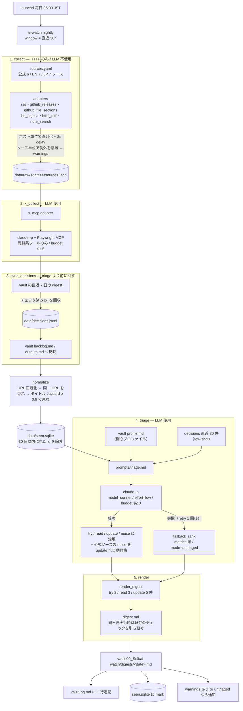
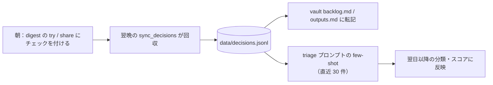

# ai-watch

LLM 周辺（Claude Code / Codex の更新、注目記事）を夜間に収集・トリアージし、Obsidian vault に朝のダイジェストを生成する個人ツール。

## 全体の流れ

`nightly` は 5 段のパイプライン。各段は `data/work/YYYY-MM-DD/{stage}.json` に中間出力を残すので、`--from <stage>` で途中から再実行できる。



LLM（`claude -p`）を使うのは **x_collect と triage の 2 箇所だけ**。残りの 20 ソースの収集は素の HTTP で、トークンを消費しない。

`--dry-run` を付けると vault には書かず `data/work/<date>/digest.md` に出力し、`sync_decisions` と `seen.sqlite` への書き込みもスキップする。

### 朝のチェックが翌日に効く仕組み



チェックを付けなかった項目は `skip_implicit` として記録される。

## セットアップ

```bash
uv sync
uv run ai-watch init-vault          # vault に profile.md 等を作る（既存は触らない）
uv run ai-watch doctor              # claude / npx / vault / MCP 設定の事前チェック
```

## 手動実行

```bash
uv run ai-watch nightly --dry-run           # vault に書かず data/work/<date>/digest.md に出す
uv run ai-watch nightly                     # 本番
uv run ai-watch nightly --from triage       # 収集済みデータから再トリアージ
uv run ai-watch collect --only hn           # 1 ソースだけ疎通
uv run ai-watch sync                        # ダイジェストのチェックを今すぐ反映
```

## launchd（毎日 05:00）

```bash
mkdir -p logs
cp launchd/com.machamp.ai-watch.plist ~/Library/LaunchAgents/
launchctl bootstrap gui/$(id -u) ~/Library/LaunchAgents/com.machamp.ai-watch.plist
launchctl kickstart -k gui/$(id -u)/com.machamp.ai-watch      # 今すぐ 1 回走らせて確認
tail -f logs/nightly.err.log
```

解除: `launchctl bootout gui/$(id -u)/com.machamp.ai-watch`

スリープで 05:00 を過ぎた場合は次の起床時に実行される（launchd の StartCalendarInterval の仕様）。

## データの置き場

- `data/raw/YYYY-MM-DD/{source}.json` — 取得生データ。90 日で消す: `find data/raw -mindepth 1 -maxdepth 1 -type d -mtime +90 -exec rm -r {} +`（v1 では手動）
- `data/work/YYYY-MM-DD/*.json` — 段ごとの中間出力（`--from` 再実行用）
- `data/seen.sqlite` — 機械の既読
- `data/decisions.jsonl` — 朝のチェック（try / share / skip_implicit）
- vault `00_Self/ai-watch/` — digests / backlog / outputs / log / profile
