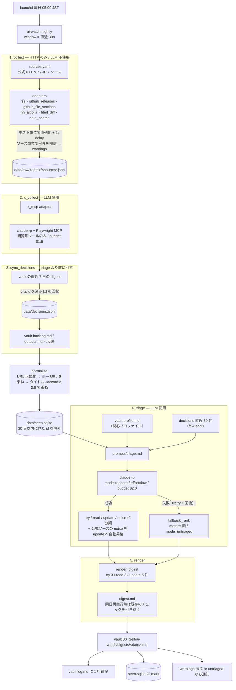
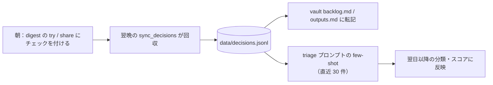

# ai-watch

LLM 周辺（Claude Code / Codex の更新、注目記事）を夜間に収集・トリアージし、Obsidian vault に朝のダイジェストを生成する個人ツール。

## 全体の流れ

`nightly` は 5 段のパイプライン。各段は `data/work/YYYY-MM-DD/{stage}.json` に中間出力を残すので、`--from <stage>` で途中から再実行できる。



LLM（`claude -p`）を使うのは **x_collect と triage の 2 箇所だけ**。残りの 20 ソースの収集は素の HTTP で、トークンを消費しない。

`--dry-run` を付けると vault には書かず `data/work/<date>/digest.md` に出力し、`sync_decisions` と `seen.sqlite` への書き込みもスキップする。

### 朝のチェックが翌日に効く仕組み



チェックを付けなかった項目は `skip_implicit` として記録される。

## セットアップ

```bash
uv sync
uv run ai-watch init-vault          # vault に profile.md 等を作る（既存は触らない）
uv run ai-watch doctor              # claude / npx / vault / MCP 設定の事前チェック
```

## 監視リスト

利用中ツールの公式更新をコード変更なしで追加または停止する場合は、リポジトリ外の監視リストを明示的に指定する。
個人設定の正本は非公開R2の`config/watchlist.yaml`とし、公開リポジトリには空の[`config/watchlist.example.yaml`](config/watchlist.example.yaml)だけを置く。
R2からの取得、初回登録、競合を検出する更新処理はIssue #2の範囲であり、現時点ではローカルへ取得した作業コピーを使う。

```bash
uv run ai-watch watchlist
AI_WATCH_WATCHLIST_FILE=/path/outside/repository/watchlist.yaml uv run ai-watch watchlist
```

設定ファイルを指定していない場合、前者は`[]`を表示し、収集は従来どおり全ソースを対象にする。
読込先は`AI_WATCH_WATCHLIST_FILE`、次に`sources.yaml`の`defaults.watchlist_file`の順で選ばれる。
サンプルは暗黙に読み込まれず、明示した値が空、ファイルがない、構文や参照が不正な場合は収集前に終了コード2で停止する。

設定レコードは次の形にする。`source_ids`は`sources.yaml`にある収集先IDを参照し、公式情報源が未確認なら空にする。

```yaml
version: 1
tools:
  - id: example-tool
    name: サンプルツール
    enabled: true
    focus:
      - サンプルの更新
    source_ids: []
```

`ai-watch watchlist`の表示は次の意味を持つ。

- `停止中`：`enabled: false`。専用収集と選別への関心情報追加を止める
- `設定待ち`：有効だが`source_ids`が空。監視正常や取得成功を意味しない
- `有効（取得結果は別途確認）`：収集先が設定されている。実際の取得結果は`collect`の出力で確認する

停止するときはレコードを削除せず`enabled: false`へ変更する。
共有ソースは別の有効なツールから参照されている限り取得され、すべての所有者が停止すると取得されない。
一方、最後の`source_ids`参照を削除すると一般ソースへ戻り、従来どおり取得対象になるため、収集先自体を廃止するときは監視リストと`sources.yaml`の両方を確認する。
`--only`を指定しても停止状態は上書きしない。

取得結果では、成功した収集先の対象期間内候補が0件なら`counts[id] = 0`、取得失敗なら`warnings`に原因が入り、そのIDは`counts`へ追加されない。
0件は「製品に更新がない」という断定ではなく、取得方式が返した対象期間内の候補が0件だったことを表す。
個人設定を表示する`watchlist`コマンドの出力は公開Actionsログへ流さない。

監視リストを変更した後、通常実行は次回の収集から新設定を使う。
`nightly --from triage`は保存済みの収集結果を保ったまま新しい関心設定で再選別し、`nightly --from render`は保存済みの選別結果を使うため再選別しない。
設定変更は過去の生データ、評価、投稿状態、既出履歴を削除しない。
自動追加UI、チャットからの設定変更、R2同期はこの管理機能には含まれない。

## 手動実行

```bash
uv run ai-watch nightly --dry-run           # vault に書かず data/work/<date>/digest.md に出す
uv run ai-watch nightly                     # 本番
uv run ai-watch nightly --from triage       # 収集済みデータから再トリアージ
uv run ai-watch collect --only hn           # 1 ソースだけ疎通
uv run ai-watch sync                        # ダイジェストのチェックを今すぐ反映
```

## launchd（毎日 05:00）

```bash
mkdir -p logs
cp launchd/com.machamp.ai-watch.plist ~/Library/LaunchAgents/
launchctl bootstrap gui/$(id -u) ~/Library/LaunchAgents/com.machamp.ai-watch.plist
launchctl kickstart -k gui/$(id -u)/com.machamp.ai-watch      # 今すぐ 1 回走らせて確認
tail -f logs/nightly.err.log
```

解除: `launchctl bootout gui/$(id -u)/com.machamp.ai-watch`

スリープで 05:00 を過ぎた場合は次の起床時に実行される（launchd の StartCalendarInterval の仕様）。

## データの置き場

- `data/raw/YYYY-MM-DD/{source}.json` — 取得生データ。90 日で消す: `find data/raw -mindepth 1 -maxdepth 1 -type d -mtime +90 -exec rm -r {} +`（v1 では手動）
- `data/work/YYYY-MM-DD/*.json` — 段ごとの中間出力（`--from` 再実行用）
- `data/seen.sqlite` — 機械の既読
- `data/decisions.jsonl` — 朝のチェック（try / share / skip_implicit）
- vault `00_Self/ai-watch/` — digests / backlog / outputs / log / profile
